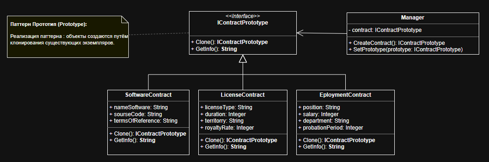

# Система генерации договоров «ContractFlow» с использованием паттерна Прототип

---

### Назначение
В современной бизнес-среде процесс создания документов часто является рутинным, но технически сложным. Договоры, коммерческие предложения и акты имеют единую структуру, но требуют индивидуализации под каждого клиента.

### Решение: Паттерн Прототип (Prototype Pattern)
Идея заключается в переходе от модели «создания с нуля» к модели «копирования образца».
*   Система при запуске создает ограниченный набор **эталонных объектов (прототипов)** для каждого типа документа. Эти объекты проходят полную, «тяжелую» инициализацию один раз.
*   При необходимости создать документ для нового клиента, система не вызывает конструктор, а **клонирует** соответствующий прототип.

---

## Диаграмма классов(UML)

---

## Вывод

| Критерий | С паттерном Прототип (Prototype) | Без паттерна (Прямая инициализация) |
| :--- | :--- | :--- |
| **Способ создания объекта** | Через `manager.CreateContract()` (клонирование готового шаблона). | Через оператор `new Class(...)` (сборка объекта с нуля). |
| **Конструктор класса** | Принимает **1 параметр** (базовое имя). Остальные поля инициализируются значениями по умолчанию внутри класса. | Требует **ВСЕ параметры** сразу. Форма должна передавать каждое поле явно. |
| **Инкапсуляция логики** | **Высокая.** Значения по умолчанию и логика инициализации скрыты внутри классов-прототипов. | **Низкая.** Логика подстановки значений вынесена в форму или требует перегрузки конструкторов. |
| **Изменение значений по умолчанию** | **Легко:** изменить в одном месте (в конструкторе прототипа). | **Сложно:** нужно править код формы или добавлять новые перегруженные конструкторы. |
| **Читаемость кода кнопки** | Чистая последовательность: `Создать прототип` → `Клонировать` → `Заполнить изменения`. | Смешанная логика: сбор данных → вызов конструктора с длинным списком аргументов. |
| **Масштабируемость** | **Высокая.** Добавление нового типа договора требует минимальных изменений в форме. | **Низкая.** Любое изменение структуры данных требует правки во всех местах вызова `new`. |
| **Гибкость настройки** | Можно динамически менять конфигурацию прототипа перед клонированием. | Каждый объект создается независимо, повторное использование настроек затруднено. |

## Итоговый вывод

1.  **Централизация конфигурации:** Все стандартные настройки договоров хранятся в самих классах-прототипах.
2.  **Поддерживаемость:** Код легче читать, тестировать и модифицировать при изменении бизнес-правил.
