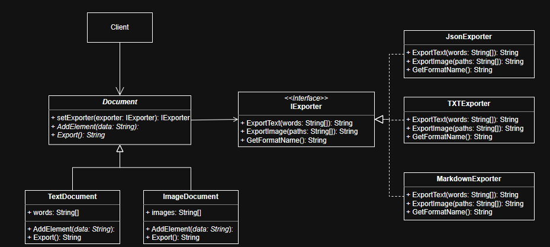

# Система конвертации документов «DocBridge» с использованием паттерна Мост

---

### Назначение
В современных информационных системах часто возникает задача поддержки множества форматов данных (JSON, Txt, Markdown) для различных типов документов (текстовые отчеты, медиа-галереи, таблицы).

Традиционный подход с использованием наследования приводит к «взрыву количества классов»: для каждой комбинации типа документа и формата экспорта требуется свой класс (например, TextTxtDocument, TextJsonDocument, ImageTxtDocument, ImageJsonDocument). Это делает систему жесткой, сложной в поддержке и расширении. Добавление нового формата требует переписывания кода всех типов документов.

### Решение: Паттерн Мост (Bridge Pattern)
Идея заключается в разделении абстракции (типа документа) и реализации (формата экспорта), чтобы они могли изменяться независимо друг от друга.

- Абстракция (**Document**): Определяет высокоуровневую логику работы с документом (добавление элементов, хранение данных). Система имеет иерархию конкретных документов: **TextDocument** (работает только с текстом) и **ImageDocument** (работает с путями к изображениям).
- Реализация (**IExporter**): Определяет низкоуровневый интерфейс для преобразования данных в конкретный формат. Система имеет набор независимых реализаций: **JsonExporter**, **TXTExporter**, **MarkdownExporter**.
- Мост: Абстракция хранит ссылку на объект реализации и делегрует ему задачу экспорта.

---

## Диаграмма классов(UML)

---

# Выводы по лабораторной работе: Паттерн Посетитель (Visitor)

## Сравнительный анализ

| Критерий | С паттерном Посетитель (Visitor) | Без паттерна (Методы внутри классов) |
| :--- | :--- | :--- |
| **Способ организации кода** | **Разделение операций:** Структура данных (`TextBlock`, `TableBlock`) отделена от алгоритмов обработки (`HTMLVisitor`, `JsonVisitor`). Операции вынесены в отдельные классы. | **Монолитная структура:** Методы экспорта (`toHtml()`, `toJson()`, `toMarkdown()`) находятся непосредственно внутри классов элементов. Данные и логика представления смешаны. |
| **Количество методов в классах** | **Минимальное (1):** Каждый класс элемента содержит только один метод `accept(visitor)`. Классы остаются «легковесными» и чистыми. | **Линейный рост ($M$):** Каждый класс элемента должен содержать отдельный метод для каждого формата. При 3 форматах — 3 метода, при 10 форматах — 10 методов в каждом классе. |
| **Расширяемость (Новая операция)** | **Высокая:** Добавление новой операции (например, «Подсчет слов» или «Экспорт в XML») требует создания всего **одного** нового класса-посетителя. Код элементов не меняется. | **Низкая:** Добавление новой операции требует модификации **каждого существующего класса элемента**. Нужно открыть `TextBlock`, `TableBlock`, `ImageBlock` и добавить туда новый метод. |
| **Принцип Open/Closed** | **Соблюден:** Система открыта для расширения (новые посетители) и закрыта для модификации (классы блоков не трогать). | **Нарушен:** Любое изменение в требованиях к форматам вынуждает переписывать код ядра системы (классов блоков), что повышает риск ошибок. |
| **Инкапсуляция** | **Высокая:** Логика конкретного формата (синтаксис HTML, правила JSON) полностью инкапсулирована внутри соответствующего посетителя и не доступна другим частям системы. | **Низкая:** Классы данных знают слишком много о том, как их следует сериализовать. Это нарушает принцип единственной ответственности (SRP). |
| **Доступ к приватным данным** | **Ограниченный (через интерфейс):** Посетитель работает с данными через публичный интерфейс элемента. Для доступа к приватным полям элемент должен явно передать их в метод `visit`. | **Полный:** Методы экспорта находятся внутри класса, поэтому имеют прямой доступ ко всем приватным полям (`private data`), что упрощает код, но усиливает связность. |

## Итоговый вывод

1.  **Разделение ответственности:** Паттерн Посетитель позволил четко разделить «структуру документа» (из чего он состоит) и «операции над документом» (как его экспортировать или анализировать). Классы блоков отвечают только за хранение данных, а классы посетителей — за логику обработки.
2.  **Защита от «раздувания» классов:** Мы избежали превращения классов `TextBlock` и `TableBlock` в огромные файлы с десятками методов `toXml()`, `toPdf()`, `countWords()`, `checkSpelling()`. Вместо этого вся специфичная логика вынесена в изолированные классы.
3.  **Упрощение поддержки и тестирования:** В реализации без паттерна добавление нового формата требовало правки во всех файлах элементов. С паттерном Посетитель мы добавили новый формат, просто создав новый файл (класс), не рискуя сломать существующую логику блоков. Это также упрощает тестирование: можно тестировать каждый формат изолированно.
4.  **Применимость:** Паттерн идеален для задач, где структура объектов стабильна (редко добавляются новые типы блоков), но набор операций над ними часто меняется или расширяется (постоянно нужны новые форматы экспорта, отчеты, анализ).
