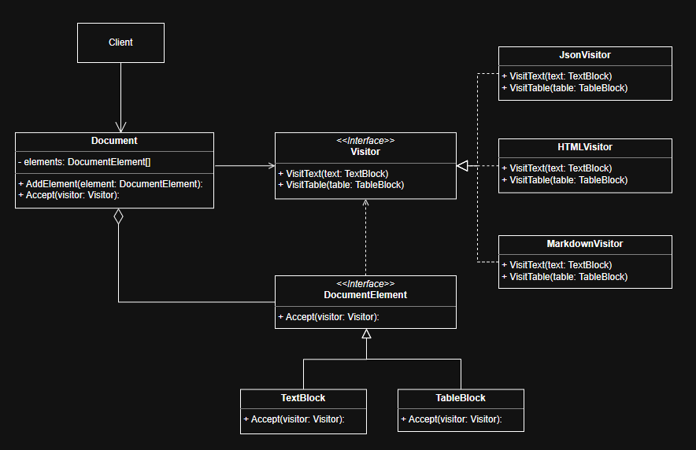

# Система конвертации документов «DocBridge» с использованием паттерна Посетитель

---

### Назначение
В современных информационных системах часто возникает задача поддержки множества форматов данных (**HTML**, **JSON**, **Markdown**) для сложных составных документов, состоящих из разнородных блоков (текст, изображения, таблицы).

Традиционный подход с добавлением методов экспорта внутрь классов блоков приводит к нарушению принципа единственной ответственности и «раздуванию» кода: каждый класс блока вынужден знать о всех возможных форматах вывода (методы `toHtml()`, `toJson()`, `toMarkdown()`). Это делает систему жесткой и сложной в поддержке. Добавление нового формата требует модификации кода **всех** существующих классов блоков, что нарушает принцип *Open/Closed* и повышает риск внесения ошибок.

### Решение: Паттерн Посетитель (Visitor Pattern)
Идея заключается в вынесении операций (алгоритмов экспорта) из структуры объектов в отдельные классы-посетители, чтобы они могли изменяться независимо от классов элементов.

- **Элементы (Element)**: Определяют интерфейс для принятия посетителя (`accept`). Система имеет иерархию конкретных блоков:
  - **`TextBlock`** (хранит текст),
  - **`ImageBlock`** (хранит пути к файлам),
  - **`TableBlock`** (хранит табличные данные).
  
  Их задача — только хранить данные и позволять посетителю работать с ними через механизм двойной диспетчеризации.

- **Посетители (Visitor)**: Определяют интерфейс операций для каждого типа элемента (`visitText`, `visitImage`, `visitTable`). Система имеет набор независимых реализаций:
  - **`HTMLExportVisitor`**,
  - **`JsonExportVisitor`**,
  - **`MarkdownExportVisitor`**,
  - **`WordCountVisitor`**.
  
  Каждый посетитель инкапсулирует логику преобразования конкретного формата, не загрязняя классы данных.
  
---

## Диаграмма классов(UML)

---
